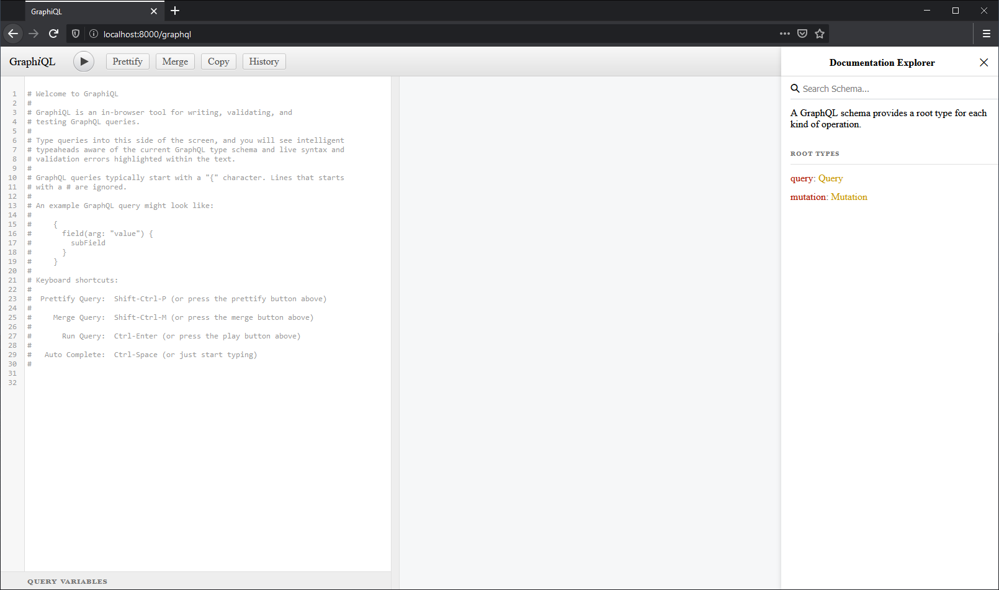

<div align="center">
  
</div>
<br/>

Lorem is a fake GraphQL API for testing and prototyping similar to that of [JSONPlaceholder](https://jsonplaceholder.typicode.com/)

## Getting started
Install dependencies
```bash
npm install
```
Running the server
```bash
npm run dev # running development server
# or
npm start # running the server on normal mode
```
Execute tests
```bash
npm test
```

## Usage
Head over to ```http://localhost:8000/graphql``` to access GraphiQL
<div align="center">
  
</div>
<br/>

### Sample Query
```javascript
// get the album with id of 1
{
  albums(id: 1){ // *removing id parameter will return a list of all the albums
    userId
    id
    title
    photos{
      albumId
      id
      title
      url
      thumbnailUrl
    }
  }
}
```
Additional fields *(see graphiql documentation explorer for more detailed info)*

- comments(id: Int): [Comment]
- photos(id: Int): [Photo]
- posts(id: Int): [Post]
- todos(id: Int): [Todo]
- users(id: Int): [User]


### Sample Mutation
```javascript
// adding a new todo item
mutation {
  addTodo(userId: 8, title: "Todo", completed: false) {
    userId
    id
    title
    completed
  }
}
```
Additional fields *(see graphiql documentation explorer for more detailed info)*

- addAlbum(userId: Int!, title: String!): Album
- addComment(postId: Int!, name: String!, email: String!, body: String!): Comment
- addPhoto(albumId: Int!, title: String!, url: String!, thumbnailUrl: String): Photo
- addPost(userId: Int!, title: String!, body: String!): Post
- addUser(input: UserInput!): User

### Making ```http``` requests
Using fetch
```javascript
const query = `
{
  albums(id: 1){
    userId
    id
    title
    photos{
      albumId
      id
      title
      url
      thumbnailUrl
    }
  }
}
`
fetch('http://localhost:8000/graphql', {
    method: 'post',
    body: JSON.stringify({ query }),
    headers: { 'Content-Type': 'application/json' }
})
    .then(res => res.json())
    .then(data => console.log(data))
    .catch(err => console.log(err))
```
Using axios
```javascript
const query = `
{
  albums(id: 1){
    userId
    id
    title
    photos{
      albumId
      id
      title
      url
      thumbnailUrl
    }
  }
}
`
axios.post('http://localhost:8000/graphql', { query })
    .then(res => console.log(res))
    .catch(err => console.log(err))
```

## Useful Resources
- https://graphql.org/learn/
- https://www.youtube.com/watch?v=ZQL7tL2S0oQ
- https://github.com/WebDevSimplified/Learn-GraphQL
- https://jsonplaceholder.typicode.com/
- https://github.com/typicode/jsonplaceholder
- https://medium.com/atheros/json-as-an-argument-for-graphql-mutations-and-queries-3cd06d252a04

## License
[MIT](./LICENSE)